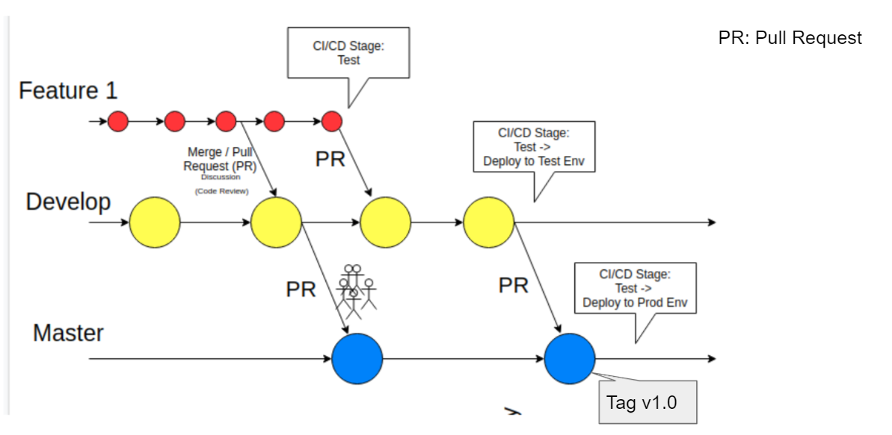
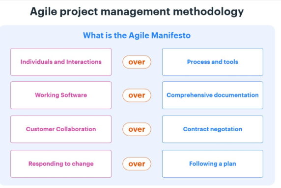
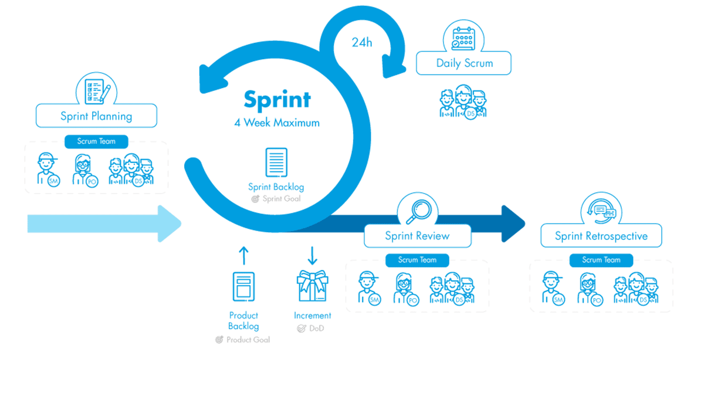

# Onboarding Handbook

This handbook is specifically for R&D team focused on Python Backend engineering.

## Table of Contents

- [Onboarding Handbook](#onboarding-handbook)
  - [Table of Contents](#table-of-contents)
  - [1. Company Values \& Vision](#1-company-values--vision)
  - [2. Unix Basic Command](#2-unix-basic-command)
    - [also bonus:](#also-bonus)
  - [3. Python Virtual Environment (venv)](#3-python-virtual-environment-venv)
    - [Definition](#definition)
    - [How to use them](#how-to-use-them)
    - [Requirements files](#requirements-files)
  - [4. Python Code Style - PEP8](#4-python-code-style---pep8)
    - [Highlights](#highlights)
  - [5. Code Editor](#5-code-editor)
    - [Must-have extensions for any projects:](#must-have-extensions-for-any-projects)
    - [Extensions for Python projects:](#extensions-for-python-projects)
    - [Auto Format Python Code](#auto-format-python-code)
    - [Linting](#linting)
  - [6. Additional Tools](#6-additional-tools)
  - [7. Git](#7-git)
    - [Git Flow](#git-flow)
    - [Commit Standard](#commit-standard)
    - [Branching Standard](#branching-standard)
    - [CI/CD](#cicd)
  - [8. TDD / BDD](#8-tdd--bdd)
    - [Test files](#test-files)
    - [TDD](#tdd)
    - [Coverage](#coverage)
    - [BDD](#bdd)
  - [9. Agile](#9-agile)
    - [Concept](#concept)
    - [Scrum - Agile Methodology](#scrum---agile-methodology)
      - [Roles](#roles)
      - [Highlights](#highlights-1)
  - [10. Python in fields](#10-python-in-fields)
    - [10.1 Crawler](#101-crawler)
    - [10.2 API](#102-api)
  - [11. Deployment](#11-deployment)
  - [12. Python Advanced Programming](#12-python-advanced-programming)
  - [Closing](#closing)


TODO:
-  Example / short practice in each of the topics

## 1. Company Values & Vision

I'll leave it to Jay. lol

But at least you should know now about:

> "We connect every possible data and make them useful"

Let's just get to the technical guidelines. 😃


## 2. Unix Basic Command

If it's possible you should develop the app under Unix-based OS, such as Ubuntu or macOS. However, if you're choosing Windows as OS. It is recommended to use WSL [(Windows Subsystem for Linux)](https://docs.microsoft.com/en-us/windows/wsl/) while developing the app to reduce any issue caused by Windows OS (trust me, most of the solutions available online is using Unix command).

The very basic Unix command you should know:

[HERE](https://www.guru99.com/must-know-linux-commands.html) (mainly `cd`, `ls`, `rm`, `cp`, `mv`, `cat`, `mkdir`)
### also bonus:

- `ssh` (connect to another computer),
- `scp` (copy file to another computer)
- `vi` (edit text file without any GUI)

## 3. Python Virtual Environment (venv)
### Definition

Basically, `venv` isolates `pip` & `python` installed packages from any other project. `venv` also helps to make our project lightweight because `venv` makes sure we only pack our app with its needed dependencies. Something like this:


In the example above, there are 3 projects inside one computer. And each project needs different dependencies from one to another. The first project needs `Python 2.7` with 2 dependencies with a certain version. While the other 2 projects use entirely different Python versions and dependencies version.

### How to use them
Make sure you've installed Python 3.6+
There are multiple ways to create a virtual environment, such as `venv`, `pyenv`, `pipenv`, etc.
We mainly use the built-in virtual environment [`venv`](https://docs.python.org/3/library/venv.html)

Commands:

- Make sure you're in the project directory
  >`python3 -m venv .venv` 

  meaning create `venv` under `.venv` directory), then
- >`source .venv/bin/activate`
  
  to "use" the virtual environment
  The terminal should now start with `(.venv)` meaning you're under the virtual environment
  
  If you check: 
    >`pip list`

    this should only contain the essential python packages
- >`deactivate` 
  
  to get out from the virtual environment

### Requirements files
“Requirements files” are files containing a list of items to be installed using pip install like so:
We have to generate `requirements.txt` in every project we created, with:

>`pip freeze > requirements.txt`

Please update the `requirements.txt` for each newly installed packages in the project.

With the `requirements.txt` exist in the project. We can install all the project's dependencies at once with:

>`pip install -r requirements.txt`


## 4. Python Code Style - PEP8
We are all inconsistent in coding. Please, at least you still trying to be consistent.
Have you ever read PEP8 before? Make sure you have at least once, scanning is fine [> CLICK HERE <](https://www.python.org/dev/peps/pep-0008/)

PEP8 is a standard way to write Python. Example:
- If in JavaScript we type variable in [`camelCase`](https://en.wikipedia.org/wiki/Camel_case).
- in Python, we write them in [`snake_case`](https://en.wikipedia.org/wiki/Snake_case).

### Highlights
- Use [PascalCase](http://wiki.c2.com/?PascalCase) to define Python class.
- Use `UPPER_CASE_WITH_UNDERSCORES` to define constant.
- Use `snake_case` to define everything else like variables, functions,
- Do not do `Capitalized_Words_With_Underscores` or `Mixing_theCase` as it's not consistent and ugly
- Name your variable clearly. Yes, avoid `x`, `y`, `a`, `b`, or `n` as it doesn't explain and it is too short. `longer_naming_but_very_clear_definition` however is preferable (but still try to be as concise as possible!).
- Code split
- Give a line break with escaping backslash `\` or simple `return` if one code line is too long
- Give appropriate spacing, such as:
  - x+y ➤ x + y
  - [1,2,3] ➤ [1, 2, 3]

About Code formatting (spaces, line width, indentation, and so on)
You can automate the formatting of your code in every file save. That'll be explained later in [HERE](#auto-format-python-code)

However, variable naming, app design, or code splitting still relies on the developer's effort. So don't stop learning :)

## 5. Code Editor
In LnData, we mainly use [VS Code](https://code.visualstudio.com/) in coding. Why?
- It's owned by Microsoft, so it'll keep being updated.
- It's flexible, can write any programming language on it
- Can be extended with plenty of extensions choices.


### Must-have extensions for any projects:
- [GitLens](https://marketplace.visualstudio.com/items?itemName=eamodio.gitlens): to extend VS code's built-in git.
- [Conventional Commit](https://marketplace.visualstudio.com/items?itemName=vivaxy.vscode-conventional-commits): to standardize commit message.
- [Git Graph](https://marketplace.visualstudio.com/items?itemName=mhutchie.git-graph): to visualize the project's git branches in a graph.

### Extensions for Python projects:
- [Python](https://marketplace.visualstudio.com/items?itemName=ms-python.python): all in one extension pack for Python. My favorite is the typing prediction.
- [Python Docstring Generator](https://marketplace.visualstudio.com/items?itemName=njpwerner.autodocstring): to auto template the docstring. 
- [Black Formatter](https://marketplace.visualstudio.com/items?itemName=ms-python.black-formatter): unify the format of the code base 

You can see the attached `.vscode` extension recommendation and settings file in [HERE](attachment/python-project/.vscode/)

### Auto Format Python Code

VS code is able to reformat the code automatically on each save. 
1.  Download the [Black Formatter](https://marketplace.visualstudio.com/items?itemName=ms-python.black-formatter) extension
2. Copy [settings.json](attachment/python-project/.vscode/settings.json) to `./.vscode/settings.json`
3. Done! You can try to modify anything on the file, and once you Save (Ctrl+S). It'll automatically format your Python code with Black formatter.

### Linting
Linting highlights syntactical and stylistic problems in your Python source code without running your codebase.
If you have installed [PyLance](https://marketplace.visualstudio.com/items?itemName=ms-python.vscode-pylance) from the Python extension above, you'll be able to see your coding mistakes in real-time, such as syntax error, undefined variable, etc.

For stricter linting: https://code.visualstudio.com/docs/python/linting

## 6. Additional Tools
In developing apps, we may not only work within the code editor only. There are recommended tools to work with:
- MySQL Client: [HeidiSQL](https://www.heidisql.com/) (Windows) or [MySQLWorkbench](https://www.mysql.com/products/workbench/) 
- MongoDB: [Robo3T](https://robomongo.org/download)
- SSH Terminal: [Termius](https://termius.com/)
- API testing: [Postman](https://www.postman.com/)

## 7. Git
You must have heard [Github](https://github.com/) before, right? It's not only to get other people's code, but it's mainly a Version Control Software (VCS). Github is basically a Git that is backed by the community. 

Git tracks every change you made to the source code with a customized message attached to every change. Without it, if you need a revision or work in the same file across the team, it will be a mess. 

all of the git activity can be done through GitLens ([see VS Code extension](#must-have-extensions-for-any-projects)), such as `git clone`, `git add`, `git commit`.

Unless you're a terminal type of person you should learn at least:
- git clone [...]
- git add [...]
- git commit [...]
- git push


### Git Flow
All of the projects have to have at least:
- `master` branch: this branch is the "production" version of the project
  
For bigger projects, we also have one version before the "production":
- `develop` branch: all of the changes made are merged here
  


1. Any new change has to be made in `feature` branch (in red). Usually, one person will take care of one small part of changes in this `feature` branch.
2. All of the modifications from multiple programmers are merged into `develop` branch. The merging process is called `Pull Request (PR)`.
3. In `PR`, you can write any information related to your change. And make sure you appoint any other programmer for peer-to-peer review (code review) and they can help you to merge the change.
   - In `PR` an automatic checking is also usually executed (Continuous integration (`CI`)
   - or if the code also want to be tested online, continuous deployment can be executed after the merge 
4. Through code review, your code would be checked by another member. This way, any inconsistent/inefficient code can be further reduced.
5. We do the same to `master` branch as well. But here we usually assign higher/senior programmers to avoid a breakdown in `production`.

Git & CI/CD are related very closely. We have [this](https://docs.google.com/presentation/d/1VMmSTcqo1yBMBMS1B98QX0TspYaMWs_YH53J8oHkc4c/edit?usp=sharing) introduction slides if you want to know more.

### Commit Standard
- Commit at every small working code modification. Don't commit the whole change at once. Some strict git users even commit every 1 minute!
- Use the [Conventional Commit](https://marketplace.visualstudio.com/items?itemName=vivaxy.vscode-conventional-commits) to have a standardized commit. Short clue:
    ```
    {topic}{scope}: {description}
    ```
    - `topic`: one of [topics](https://dev.to/couchcamote/git-branching-name-convention-cch) (`features`, `bugfix`, etc..)
    - `scope`: where the modification taking place, such as `UI`, `model`, `formula`, `IG-crawler`, anything you want!
    - `description`: short information of the change

also, if you're solving some task from your sprint/backlog, you can attach the taskID in the end of the commit
### Branching Standard
```
{topic}/{branch-name}
```
- topic: one of [topics](https://dev.to/couchcamote/git-branching-name-convention-cch) (`features`, `bugfix`, etc..)
- branch-name: short information of the purpose of the branch (example: "modify-calculation-API")

  so the branch name will be `features/modify-calculation-API`
###  CI/CD
We have mentioned CI/CD before in the git section. As we have discussed, CI/CD works close with git.
- The Continuous Integration scripts are executed as the programmer push/merge. `CI` makes sure there's no code conflict in a single codebase with multiple programmers. Also able to check if the new change can run correctly (related to [test files](#test-files))
- The Continuous Deployment scripts automatically deploy the code to the target environment. So after the `PR` is accepted, the new feature will be available on the target environment (for example testing environment). So no more manually build and deploy the new change!

The CI/CD script itself is custom-made by the programmer entitled with DevOps position (you can also create it on your own!). This script is stored in every project's root directory named `.gitlab-ci.yml`. Gitlab will automatically read this file to execute the CI/CD script.

Not everyone has to be able to write the script. But it's a nice skill to have!
## 8. TDD / BDD
### Test files
To make sure the whole app is working well in every new modification, we need to write the test files.

For example, if you create a function `multiplication` function we should make sure `2*2=4` or `5*2=10`. In python we usually use simple [`pytest`](https://docs.pytest.org/en/6.2.x/).

### TDD
TDD is a concept to write your test files first before creating the function. So if you want to make `multiplication` function, you can write the test files first. Then, modify your code one by one until it gives a correct result. This way, you won't miss writing test files, and also the function integrity would not be questioned. [Learn more](https://stackabuse.com/test-driven-development-with-pytest/)

### Coverage
In addition to testing the correctness of the code, we also need to check if the unit test cover the whole line of code. For example if you have this function:
```python
1 def divide(num1, num2):
2  if num2 == 0:
3    raise ValueError("Cannot divide by 0!")
4  return num1 * num2
```
but we only have a test file to check everything (ex: `divide(1,2) == 0.5`, `divide(4,2)==2`, etc) but not `divide(1,0)` (divide by 0), the test file is not cover the function well enough.

In this case, the coverage will only be: `50%` (line 1 and 4) because the test files never test line 2 and 3. 

### BDD
```
TO DO
```

## 9. Agile
### Concept

Agile is a framework for the project and team management. Maybe you're not the one who manages people, but you need to understand the concept to be able to follow the project manager!

Agile has these values:


[Learn more](https://www.atlassian.com/agile)
### Scrum - Agile Methodology
In every project we've been working on, we implement Scrum. Even the daily huddle we have every morning at 9.50 am is also one of the Scrum methods

#### Roles
Scrum separates people in the project into roles:
- **Project Owner** (PO): A person who knows which is the priority, what features to implement, etc. Usually, the one who works closely with the client, the user.
- **Scrum Master**: A person that controls the team to follow the Scrum rules. Have to understand the Scrum values, concepts, and practices. Usually anyone in the team except PO.
- **Team member**: Every member who adds value to the product and makes happen the product requirement. Yes, probably it's you!

#### Highlights

- Every project applies scrum sprint. One sprint can be 1 week - 2 weeks. We have to set a sprint goal in each of the sprints. 
- In each of the scrum sprints, we select tasks for each person depending on the workload that each person can handle
- Each project runs daily scrum, answering:
  - What did I do yesterday?
  - What do I plan to do today?
  - Are there any obstacles?
- And by the end of each scrum sprint, each project runs:
  - [Sprint Review](https://www.atlassian.com/agile/scrum/sprint-reviews): Reviewing the result of the sprint, also plan & select for the next sprint 
  - [Sprint Retrospective](https://www.atlassian.com/agile/scrum/retrospectives): It's like the sprint review but more about everything else, not the result. It can be the review of the teamwork, the management, etc
  

## 10. Python in fields
### [10.1 Crawler](pages/10.1crawler.md)
Go [here](pages/10.1crawler.md) for details
### [10.2 API](pages/10.2api.md)
Go [here](pages/10.2api.md) for details
## [11. Deployment](pages/11.deployment.md)
Go [here](pages/11.deployment.md) for details

## [12. Python Advanced Programming](pages/12.pap.md)
Go [here](pages/12.pap.md) for details


## Closing
Thank you for reading this handbook.

Please don't hesitate to update this handbook if there's a change in LnData or you have something interesting to share.

Hope you can enjoy the time learning together in LnData!
______
2022/05/22

Arnold Samuel Chan 曾小龍</br>
arnold.chan@lndata.com
